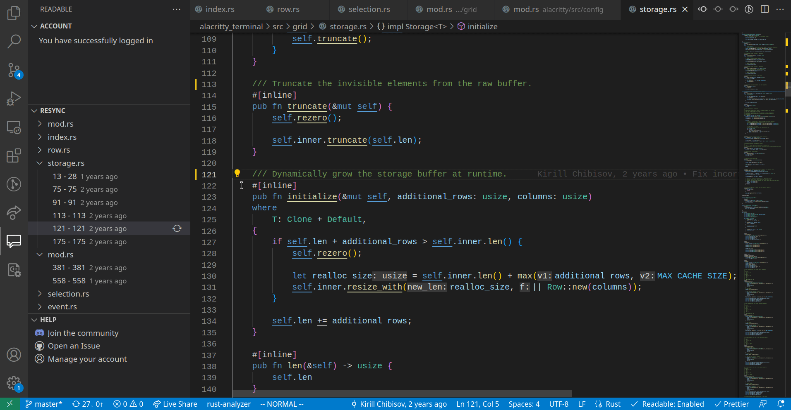

[github-shield]: https://img.shields.io/github/stars/ReadableLabs/readable-vscode?style=social
[github-url]: https://github.com/ReadableLabs/readable-vscode
[discord-shield]: https://img.shields.io/discord/890351923960627240?label=Discord
[discord-url]: https://discord.com/invite/UkMNCJu2x3
[twitter-shield]: https://img.shields.io/twitter/follow/ReadableLabs?style=social
[twitter-url]: https://twitter.com/ReadableLabs

[![Github][github-shield]][github-url]
[![Discord][discord-shield]][discord-url]
[![Twitter][twitter-shield]][twitter-url]

# Save Time With Comments

Readable is a VSCode extension which generates comments using AI. It's fast, reliable, consistent, and will save you loads of time.

# Find Stale Comments

Readable shows you stale comments, and lets you easily regenerate them from the side bar.

## Works in 10 Languages

- **Typescript**
- **Javascript**
- **JSX/TSX**
- **Python**
- **C**
- **C#**
- **C++**
- **Java**
- **PHP**
- **Rust**

## Docstring Comments

To generate a docstring press **ctrl '** (**cmd '** on Mac) while your cursor is in any function. Alternatively highlight a piece of code and generate a comment.

## Inline Comments

To generate an inline comment type **//** for C-Sytle languages. For python type **#**. After hitting space, press **tab** to generate an inline comment. Optionally, type a few words after **//** to generate a more specific comment.

## Pricing

Readable is free to use; it shows stale comments in your codebase. If you want to generate comments with Ai, Readable is $19.99 per year. You can start a free trial on [readable.so](https://readable.so)

## Privacy

Readable does not store or use your code to train any of its models.

Note: Read OpenAI's privacy policy if you are unsure about what they do.

## Getting Set Up

When you first install Readable, you will be prompted to log in or create an account. Readable supports two forms of authentication: GitHub login and email.

If you would like to enable/disable comment suggestions, then you can run "Readable: Enable Comment Suggestions", or "Readable: Disable Comment Suggestions" via the command palette.

## Requirements

- VSCode
- An internet connection to generate comments

## Extension Settings

You can configure the following settings:

- `readable.enableAutoComplete`: enable/disable comments

## Known Issues

- Readable sometimes fails to generate a comment. The issue is currently being worked on.

## Release Notes

## [2.0.1]

- Bug fixes

### Contact

Feel free to email support@readable.so for any questions/comments you may have about Readable. The team reads all emails and will get back to you ASAP.

2022, Puri Chapman Software LLC
